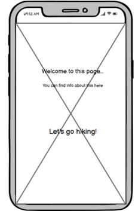

# Hiking at Södertörn

This site is built for educational purposes only. It is the Milestone Project 2 for the Software Development Diploma course at Code Institute, and it is aimed to display my understanding of Javascript and how it can be used to build interactive websites.

A live version of the website can be viewed here

Images of site 

This is an interactive website built for people hiking with children. The primary goal for this website is to make it easy for hikers with children to find information about available services and length of hiking trails for different starting points in the area of Södertörn. The purpose of this is to encourage parents and other adults to go hiking with their children and experiencing nature together, while also getting fresh air and physical exercise at the same time. Experiencing nature close-up in childhood is known to strengthen childrens relationship with nature even into adulthood. This enhances the probability of engaging in protecting nature and our environment and making life-style choices reflecting this engagement. Hiking together is also a great way of strengthening the relationship between parent and child, bonding around the mutual experiences, which is important for every child's mental health.

This site contains interactive elements such as on click animations, on click alert box and geographical information provides through google maps API. All parts of the site is mobile friendly and responsive.

__Business and client goals__

The business goals of this website is to:
* Encourage people to go hiking with their children 

The clients goal of this website is to:

* Get information about where to find starting points for child-friendly hiking trails on Södertörn
* Get information about the length of different hiking trails
* Get information about important services provided on or nearby the trails, such as prepared fireplaces and toilets

## UX

__Ideal client__

The ideal client for this website is:

- A hiking parent or some other adult hiking with children

- Swedish speaking

- Lives near or on Södertörn or is thinking of visiting Södertörn

Visitors to this website are looking for: 

- Finding starting points for child-friendly hiking trails on Södertörn

- Finding information about what services are accessible nearby the different starting points

- Finding information about the length of different hiking trails accessible from the starting points

- Finding more in-depth information about and pictures of the different starting points and their hiking trails

This project is the best way to help them achieve this because:

- This website provides an interactive map of Södertörn with starting points of hiking trails marked out and easy to find

- It provides information about services such as prepared fireplaces and toilets, accessed with just a click from the user

- It provides easily accessible information about the length of different hiking trails, enabling visitors to quickly find a trail of suitable length 

- It provides in-depth information about and pictures of the different starting points and hiking trails, accessible both from a menu and from the alert box appearing when clicking on the pin for the starting point

- It has a clear and well-structured design and good readability, making it easy for the user to get an overview of the site and its information

- This website is easy to navigate, as it provides menu bar on every page inside it

__User stories__

- As a first time user, I want to quickly get an overview of what this site is for 

Mobile:

Tablet:

Screen: 

- As a hiker with children, I want to easily find suitable hiking trails in the area of Södertörn

Mobile:

Tablet:

Screen: 

- As a hiker with children, I want to find out if the starting points/hiking trails provide access to:
 1. Prepared fireplaces so I can make warm food for myself and the children
 2. Toilets or portable toilets
 3. Wind shelters if it starts to rain heavily or becomes very windy and the children needs shelter to stay warm
 4. Hiking rails that you can walk with a child in stroller
 5. Hiking trails with a length that is suitable for my childrens age and stamina
 

 

- As a hiker with children, I want to be able to find more in-depth information about and some pictures of the different trails and starting points so I can show them to my children and get them interested in going there

Mobile:

 

Tablet:

Full-screen:

## Acceptance Criteria

## Credits

### Content

* The content of the information pages for the starting points (Tyresta By, Paradiset and Rudan) is borrowed from the following websites:

https://sv.wikipedia.org/wiki/Rudans_g%C3%A5rd

https://www.haninge.se/uppleva-och-gora/friluftsliv-motion/naturreservat-och-friluftsomraden/rudans-friluftsomrade-och-naturreservat/

 https://sv.wikipedia.org/wiki/Tyresta_nationalpark#Tyresta_by

 https://www.haninge.se/uppleva-och-gora/besok-och-upplev-haninge/platser-att-besoka/tyresta/

 https://sv.wikipedia.org/wiki/Paradisets_naturreservat

 http://www.paradiset-hanveden.se/sti.html

 ### Media

 * The images displayed on the info pages for the starting points (Tyresta By, Paradiset and Rudan) have been borrowed from the sites listed above, and from:

 https://sv.wikipedia.org/wiki/Nedre_Rudasj%C3%B6n

 * 

 
### Code

The Google API:s on the site have been implemented with support from Google Maps API tutorial

## Debugging

Code for fading landing page to show map page failed to work. With help from tutor support I decided to change the way of creating landing page from 
having a separate index.html and map.html respectively, to creating a landing page by using an overlay div. This allowed for the use of jquery fadeOut 
effect to fade the overlay div out, showing the map page underneath.