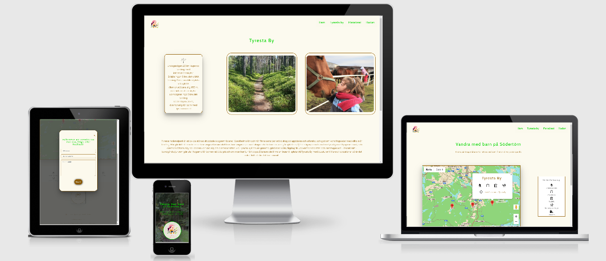
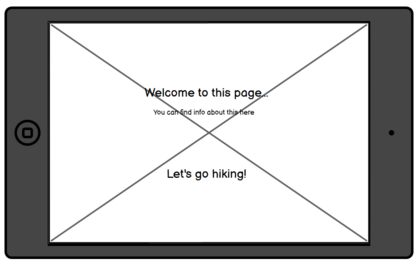

# Hiking at Södertörn

This site is the Milestone Project 2 for the Software Development Diploma course at Code Institute, and it is 
aimed to display my understanding of Javascript and how it can be used to build interactive websites.

[A live version of the website can be viewed here](https://mmmangooo.github.io/Milestone-Project2/)

This is an interactive website built for people hiking with children. The primary goal for this website is to make it easy for hikers with children to find 
information about available services and length of hiking trails for different starting points in the area of Södertörn. The purpose of this is to encourage 
parents and other adults to go hiking with their children and experiencing nature together, while also getting fresh air and physical exercise at the same time. 
Experiencing nature close-up in childhood is known to strengthen childrens relationship with nature even into adulthood. This enhances the probability of engaging 
in protecting nature and our environment and making life-style choices reflecting this engagement. Hiking together is also a great way of strengthening the 
relationship between parent and child, bonding around the mutual experiences, which is important for every child's mental health.

This site contains interactive elements such as on click showed elements, geographical information provided through google maps API and email sending through email service. 
All parts of the site is mobile friendly and responsive.

__Societal and user goals__

The societal improvement goals of this website is to:

* Encourage people to go hiking with their children - bettering their health by physical exercise, bettering their parent-child bond through mutual experiences and bettering their 
  commitment to preserving nature and making climate-friendly choices by strengthening their bond to nature

The clients goal of this website is to:

* Get information about where to find starting points for child-friendly hiking trails on Södertörn
* Get information about the length of different hiking trails
* Get information about important services provided on or nearby the trails, such as prepared fireplaces and toilets

## UX

__Ideal client__

The ideal client for this website is:

- A hiking parent or some other adult hiking with children

- Swedish speaking

- Lives near or on Södertörn or is thinking of visiting Södertörn

Visitors to this website are looking for: 

- Finding starting points for child-friendly hiking trails on Södertörn

- Finding information about what services are accessible nearby the different starting points

- Finding information about the length of different hiking trails accessible from the starting points

- Finding more in-depth information about and pictures of the different starting points and their hiking trails

This project is the best way to help them achieve this because:

- This website provides an interactive map of Södertörn with starting points of hiking trails marked out and easy to find

- It provides information about services such as prepared fireplaces and toilets, accessed with just a click from the user

- It provides easily accessible information about the length of different hiking trails, enabling visitors to quickly find a trail of suitable length 

- It provides in-depth information about and pictures of the different starting points and hiking trails, accessible both from a menu and from the alert box appearing when clicking on the pin for the starting point

- It has a clear and well-structured design and good readability, making it easy for the user to get an overview of the site and its information

- This website is easy to navigate, as it provides menu bar on every page inside it

__User stories__

1. As a first time user, I want to quickly get an overview of what this site is for 

Mobile:

Tablet:

Screen: 

2. As a user, I want to be able to easily navigate to different pages on the site and back again

3. As a hiker with children, I want to easily find suitable hiking trails in the area of Södertörn

Mobile:

Tablet:

Screen: 

4. As a hiker with children, I want to find out if the starting points/hiking trails provide access to:
 * Prepared fireplaces so I can make warm food for myself and the children
 * Toilets or portable toilets
 * Wind shelters if it starts to rain heavily or becomes very windy and the children needs shelter to stay warm
 * Hiking trails that you can walk with a child in stroller
 * Hiking trails with a length that is suitable for my childrens age and stamina
 

 

5. As a hiker with children, I want to be able to find more in-depth information about and some pictures of the different trails and starting points so I can show them to my children 
  and spark their interest in going there

Mobile:

 

Tablet:

Full-screen:

6. As a user, I want to be able to contact the website administrator to alert them if something on the site is not working, or to suggest another
  starting point to be added to the site.

### Design

* Color scheme: The purpose of the colors  chosen is to create both a harmonious impression with colors and contrast that are easy on the eye and 
  provide good readability, and to create an impression of happiness and playfulness. Another aspect influencing color choices was to relate them to
  the core theme of the website - nature and outdoors. To achieve this, the color #fcf9edde was chosen for the backgrounds and #946006 for text element. 
  The two colors together create a warm impression, as well as relating to the nature theme of the site. For contrast, the colors #f18386 and #04d600 were 
  chosen to create a feeling of playfulness that goes along with the fact that this site being aimed at families with children.

  

* Typography: The intention behind the chosen fonts is to create an impression of friendliness, playfulness and a 'lightness' that signals youth,
  because the site is aimed at parents and their children. The font used for headers - 'Cabin' - is easy to read, straighforward and uncomplicated 
  and gives a slightly 'childish' and friendly impression. The font used for text elements - 'Poppins' gives an impression of friendliness and 
  provides good readability.

* Imagery: Images on this site mainly playes the role of engaging the user's emotions and trigger a lust to go hiking with their children. The images
  are chosen to display feelings of connectedness, enjoying nature and being together.

#### Differences between wireframes and implemented design

* In the original design, the info windows had the functionality of a link that when clicked activated an animation of a card flipping over, 
  and the info window then showing a different information. This information would consist of the length and terrain difficulty of that starting point.
  However, this proved to be too difficult to achieve (see more details in "known bugs"-section). The design was therefor changed, so that the information
  about the hiking trails available from each starting point is instead displayed in the info page of each location. 

* The contact-button for opening contact form was originally placed in bottom-left corner to create F-shaped reading pattern on the page, and it was fixed to the 
  screen to follow the user when scrolling. However, this proved to clutter the pages, particularly on smaller screens, and hide the important content on page.
  Therefore the contact-button was moved to just above the footer and staying at the bottom while user scrolls.

## Features

Every page except for landing page contains a navigation bar and a logo . The navigation bar collapses to hamburger 
menu on smaller screens to ensure responsiveness. Each page (apart from landing page) also contains a footer with copyright information and links to the different pages on the
site, to provide navigation possibilites to the user from the bottom of the pages also. In the bottom of the footer there are links to the sites where the icons used on the sides
are from. These links are a requirement from the sites in order for the icons to be permitted to be used. 

### Index/landing
The index/landing page features a background image of a family walking on a forest road, chosen to create an immediate emotional connection to the purpose of the site 
(which is to encourage people to go hiking with children) through this visual impression of a hiking activity together. In the middle of
the landing page is the name of the site and a short sentence explaining the functionality of the site, to immediately tell the user what this site is for.
Below the name is an invite to enter the page, with a colorful logo of a child hiking. The purpose of this is to create a welcoming feeling, and the icon is chosen 
to enhance the impression of this site as being aimed at parents and families with children, as well as creating a feeling of playfulness. When this link is clicked, 
the user is taken to the home/map page.

### Home/map 
The home/map page features a map of Södertörn, with pins visible at a few hiking starting points. The map takes up most of this page, which is because it constitutes
the most part of the purpose and functionality of this site, and therefore should also immideately catch the viewers attention. On the top left of the page is a logo,
the same logo that is shown on the landing overlay, which is made to create a feeling of familiarness and act as a reminder of the purpose of the site (hiking with children).
Since humans (in most western cultures, which is what this site is aimed for) reads from left to right, the logo on the top left should draw the viewers attention 
after the map, and the next thing that catches the eyes should be the navigation bar on the top right. After reading the top 'line', the viewer's eyes will move down to the 
left to find the next 'line' to read, where they find the text explaining how to use the map. This design is aimed at making the site intuitively easy to understand 
for the user and ensure that the user immediatly finds the functionality they are looking for.

### Info windows

When a user clicks a pin on the map, an information window appears. This window contains icons representing the services available on the location clicked, for example
prepared fireplaces or toilets. This is made so that the user can get an immediate overview of the services available at each location just by clicking one time, thus 
facilitating the user's decision-making on where to go hiking. The infowindows also contains a link that takes the user to a page with more detailed information about 
that particular location. This is made to provide the user with more in-depth information if needed, without passing too much information in to the first displayed 
info-window and deteriorate its purpose of being easy to overview.

### Information pages

There are one information page for each location (starting point) on the map, and these pages are accessible both from the link in the info window described above
and from the navigation menus. The information pages contain information about the length and terrain-difficulty of the hiking trails available, more in-depth information about 
the location, and a few pictures aimed at showing whatit looks like there. The purpose of this is to provide more information if needed to make a decision about where to go, but 
also to help create an interest in both the adult and the child/-ren to visit the location. 

### Contact modal

A contact modal accessible through a contact button is placed above the footer of all pages (except from landing page). In the contact modal there
is a form when filled out sends an email to the site owner through EmailJS email service. This functionality is included to provide the user with a quick way of 
contacting the site owner with questions, feedback on the site's functionality or tips on other hiking startpoints to add to the site.

### Features left to implement

* The originally intended flip card-animation on info windows may be implemented when the developer has gained more experience in javascript and has the time to solve the issue
* More locations can be added to the site in the future

## Technologies used

* This project uses HTML, CSS ans JavaScript programming languages
* [GitPod](https://www.gitpod.io/) was used as an IDE for building this website
* [GitHub](http://github.com)GitHub was used to store the projects code after being pushed from Git.
* [Git](https://git-scm.com/) was used for version control by utilizing the Gitpod terminal to commit to Git and Push to GitHub.
* [BootstrapCDN](https://getbootstrap.com/) was used for simplified process of structuring the website, facilitate in making it responsive and for adding certain elements. 
* [Google Fonts](https://fonts.google.com/) was used for styling fonts.
* [Balsamiq](https://balsamiq.com/) was used for creating the wireframes during the design process.
* [GoogleMaps Styling Wizard](https://mapstyle.withgoogle.com/) was used in this project for styling the google map.
* [PicResize](https://picresize.com/) was used to resize large images.
* [Resize Image.net](https://resizeimage.net/) was also used to resize large images.
* [EmailJS](https://www.emailjs.com/) is used on this site to provide the funcitonality of sending emails through the contact form.
* [Autoprefixer](https://autoprefixer.github.io) was used to prefix css code.
* [Tiny PNG Image compressor](https://tinypng.com/) was usd to compress images.
* [Free formatter CSS beautifier](https://www.freeformatter.com/css-beautifier.html) was used to ensure CSS is properly indented and formatted.

## Testing

Information about testing is provided in separate file, [that can be found here:](/TESTING.md/)

## Deployment

This website was developed using GitPod and Git, with repository hosted on GitHub.

### GitHub Pages
This website was deplyed to GitHub Pages using the following steps:

1. Opened up GitHub in browser and signed in using usename and password. 
2. Navigated to My repositories, where I clicked on the repository Mileston-Project2. 
3. Clicked settings in the top navigation and scrolled down to GitHub Pages. 
4. Selected Master Branch in the dropdown menu and clicked to confirm this choice. 
5. The website was now live on GitHub Pages.

### Making a local clone
1. Navigate to GitHub Repository (https://github.com/mmmangooo/Milestone-Project2). 
2. Click the green Code button and copy the URL in the dropdown box. 
3. Use your IDE of choice to open up a terminal and navigate to your choice of file location. 
4. Use the 'git clone' command in the terminal followed by the copied git URL. 
5. A clone of the project will now be created locally on your machine.

## Credits

* Code Institute student Daisy Mc Girr's webinar on testing

### Content

* The information text in the information pages for the starting points was written by Isabelle Ängsås. The information provided in the text was found in the following sources:

[Rudans gård, Wikipedia](https://sv.wikipedia.org/wiki/Rudans_g%C3%A5rd)

[Haninge municipality's webpage, visit Rudan](https://www.haninge.se/uppleva-och-gora/friluftsliv-motion/naturreservat-och-friluftsomraden/rudans-friluftsomrade-och-naturreservat/)

[Tyresta nationalpark, Tyresta By, Wikipedia](https://sv.wikipedia.org/wiki/Tyresta_nationalpark#Tyresta_by)

[Haninge municipality's webpage, visit Tyresta](https://www.haninge.se/uppleva-och-gora/besok-och-upplev-haninge/platser-att-besoka/tyresta/)

[Paradiset, Wikipedia](https://sv.wikipedia.org/wiki/Paradisets_naturreservat)

[Civil organization Paradiset-Hanveden's webpage](http://www.paradiset-hanveden.se/sti.html)

 ### Media

* All images are from [Unsplash](https://unsplash.com) and the photograpers are:

    * The background image displayed on the landing page: Juliane Liebermann.

    * Image of red cottage window on info-page for Paradiset: Andreas Eriksson.

    * Image of kids in a swing on info-page for Rudan: Rashid Sadykov.

    * Image of lake with bridge on info-page for Rudan: Aaron Burden. 

    * Image of girl kissing horse on info-page for Tyresta: Lucie Hosova.

    * Image of autumn lake on info-pages for Paradiset: Uniq Trek.

    * Image of forest path on info-page for Tyresta: Malin (last name unknown).

    * Icons used on the page are from [Icons8](https://icons8.com/) and [Flaticon](https://www.flaticon.com/)

 
### Code sources

* The Google API:s on the site have been implemented with support from [Google Maps API tutorial](https://developers.google.com/maps/documentation/javascript/adding-a-google-map) and 
  [this tutorial made by Code Institute student Eamonn Smyth](https://slack-files.com/T0L30B202-F01DRAEPEH5-16d0e0a646)

* Contact modal have been set up and style with guidance from [W3schools](https://www.w3schools.com/howto/howto_css_modals.asp) and 
  [CSS-tricks](https://css-tricks.com/considerations-styling-modal/)

* Send button created with, and its code copied from, [CSS Button creator](https://cssbuttoncreator.com/)

* Dark layer on background image on landing page: 
  [Thread on stack overflow](https://stackoverflow.com/questions/5770341/i-do-not-want-to-inherit-the-child-opacity-from-the-parent-in-css) and
  [Webdesign blog](https://webdesign.tutsplus.com/articles/css-tips-for-better-color-and-contrast-accessibility--cms-34472)

* Making landing page take up no more or less than 100% of viewport height on mobile (setting viewport height did give wanted result): 
  [Development blog](https://dev.to/admitkard/mobile-issue-with-100vh-height-100-100vh-3-solutions-3nae)

* Solution to warnings in JSHint for the variable 'let':
  [Stack Overflow:](https://stackoverflow.com/questions/37247474/es6-in-jshint-jshintrc-has-esversion-but-still-getting-warning-using-atom/42865871)

### Acknowledgements

* Thanks to tutor support for helpful guidance with debugging issues

* Thanks to mentor Sinead O'Brien for valuable input and guidance

