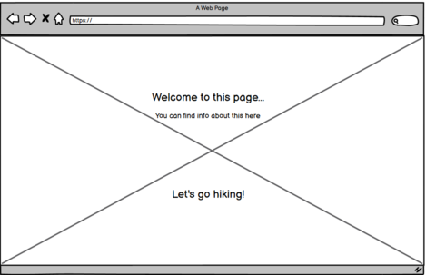
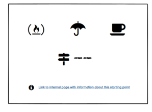

# Hiking at Södertörn

This site is the Milestone Project 2 for the Software Development Diploma course at Code Institute, and it is 
aimed to display my understanding of Javascript and how it can be used to build interactive websites.

[A live version of the website can be viewed here](https://mmmangooo.github.io/Milestone-Project2/)

Images of site 

This is an interactive website built for people hiking with children. The primary goal for this website is to make it easy for hikers with children to find 
information about available services and length of hiking trails for different starting points in the area of Södertörn. The purpose of this is to encourage 
parents and other adults to go hiking with their children and experiencing nature together, while also getting fresh air and physical exercise at the same time. 
Experiencing nature close-up in childhood is known to strengthen childrens relationship with nature even into adulthood. This enhances the probability of engaging 
in protecting nature and our environment and making life-style choices reflecting this engagement. Hiking together is also a great way of strengthening the 
relationship between parent and child, bonding around the mutual experiences, which is important for every child's mental health.

This site contains interactive elements such as on click animations, on click alert box and geographical information provides through google maps API. 
All parts of the site is mobile friendly and responsive.

__Business and client goals__

The business goals of this website is to:
* Encourage people to go hiking with their children 

The clients goal of this website is to:

* Get information about where to find starting points for child-friendly hiking trails on Södertörn
* Get information about the length of different hiking trails
* Get information about important services provided on or nearby the trails, such as prepared fireplaces and toilets

## UX

__Ideal client__

The ideal client for this website is:

- A hiking parent or some other adult hiking with children

- Swedish speaking

- Lives near or on Södertörn or is thinking of visiting Södertörn

Visitors to this website are looking for: 

- Finding starting points for child-friendly hiking trails on Södertörn

- Finding information about what services are accessible nearby the different starting points

- Finding information about the length of different hiking trails accessible from the starting points

- Finding more in-depth information about and pictures of the different starting points and their hiking trails

This project is the best way to help them achieve this because:

- This website provides an interactive map of Södertörn with starting points of hiking trails marked out and easy to find

- It provides information about services such as prepared fireplaces and toilets, accessed with just a click from the user

- It provides easily accessible information about the length of different hiking trails, enabling visitors to quickly find a trail of suitable length 

- It provides in-depth information about and pictures of the different starting points and hiking trails, accessible both from a menu and from the alert box appearing when clicking on the pin for the starting point

- It has a clear and well-structured design and good readability, making it easy for the user to get an overview of the site and its information

- This website is easy to navigate, as it provides menu bar on every page inside it

__User stories__

- As a first time user, I want to quickly get an overview of what this site is for 

Mobile:

Tablet:

Screen: 

- As a hiker with children, I want to easily find suitable hiking trails in the area of Södertörn

Mobile:

Tablet:

Screen: 

- As a hiker with children, I want to find out if the starting points/hiking trails provide access to:
 1. Prepared fireplaces so I can make warm food for myself and the children
 2. Toilets or portable toilets
 3. Wind shelters if it starts to rain heavily or becomes very windy and the children needs shelter to stay warm
 4. Hiking rails that you can walk with a child in stroller
 5. Hiking trails with a length that is suitable for my childrens age and stamina
 

 

- As a hiker with children, I want to be able to find more in-depth information about and some pictures of the different trails and starting points so I can show them to my children and get them interested in going there

Mobile:

 

Tablet:

Full-screen:

* As a user, I want to be able to contact the website administrator to alert them if something on the site is not working, or to suggest another
  starting point to be added to the site.

### Design

### Differences to original design

* In the original design, the info windows had the functionality of a link that when clicked activated an animation of a card flipping over, 
  and the info window then showing a different information. This information would consist of the length and terrain difficulty of that starting point.
  However, this proved to be too difficult to achieve (see more details in "known bugs"-section). The design was therefor changed, so that the information
  about the hiking trails available from each starting point is instead displayed in the info page of each location. 
* The contact-button for opening contact form was originally placed in bottom-left corner to create F-shaped reading pattern on the page, and it was fixed to the 
  screen to follow the user when scrolling. However, this proved to clutter the pages, particularly on smaller screens, and hide the important content on page.
  Therefore the contact-button was moved to the footer and staying at the bottom while user scrolls.

## Acceptance Criteria

## Features

Every page contains a navigation bar and a logo with link to start page, which both are fixed to the top to stay visible if user scrolls the page. 
The purpose of these features is to provide easily accessible navigation regardless of where the user is on the site. The navigation bar collapses to hamburger 
menu on smaller screens to ensure responsiveness. Each page also contains a footer with copyright information.

### Index/landing
The index/landing page features a background image of a family walking on a forest road, chosen to create an immediate emotional connection to the purpose of the site 
(which is to encourage people to go hiking with children) through this visual impression of a hiking activity together. In the middle of
the landing overlay is the name of the site and a short sentence explaining the functionality of the site, to immediately tell the user what this site is.
Below the name is an invite to enter the page, with a colorful logo of a child hiking. The purpose of this is to create a welcoming feeling, and the icon is chosen 
to enhance the impression of this site as being aimed at parents and families with children, as well as creating a feeling of playfulness. When this link is clicked, 
the user is taken to the home/map page.

### Home/map 
The home/map page features a map of Södertörn, with pins visible at a few hiking starting points. The map takes up most of this page, which is because it constitutes
the most part of the purpose and functionality of this site, and therefore should also immideately catch the viewers attention. On the top left of the page is a logo,
the same logo that is shown on the landing overlay, which is made to create a feeling of familiarness and act as a reminder of the purpose of the site (hiking with children).
Since humans (in most western cultures, which is what this site is aimed for) reads from left to right, the logo on the top left is going to draw the viewers attention 
after the map, and the next thing that catches the eyes is the navigation bar on the top right. After reading the top 'line', the viewer's eyes will move down to the 
left to find the next 'line' to read, where they find the text explaining how to use the map. This design is aimed at making the site intuitively easy to understand 
for the user.

### Info windows

When a user clicks a pin on the map, an information window appears. This window contains icons representing the services available on the location clicked, for example
prepared fireplaces or toilets. This is made so that the user can get an immediate overview of the services available at each location just by clicking one time, thus 
facilitating the user's decision-making on where to go hiking. The infowindows also contains a link that takes the user to a page with more detailed information about 
that particular location. This is made to provide the user with more in-depth information if needed, without passing to much information in to the first displayed 
info-window and deteriorate its purpose of being easy to overview.

### Information pages

There are one information page for each location (starting point) on the map, and these pages are accessible both from the link in the info window described above
and from the navigation menu. The information pages contain information about the length and terrain-difficulty of the hiking trails available, more in-depth information about the different locations, and a few pictures aimed at showing what the sites
look like. The purpose of this is to provide more information if needed to make a decision about where to go, but also to help create an interest in both the adult and
the child/-ren to visit the location. 

### Contact modal

A contact modal accessible through a contact button is placed in the footer of all pages that has a footer (i e all except from index page). In the contact modal there
is a form when filled out sends an email to the site owner through EmailJS email service. This functionality is included to provide the user with a quick way of 
contacting the site owner with questions, feedback on the site's functionality or tips on other hiking startpoints to add to the site.

## Technologies used

* This project uses HTML, CSS ans JavaScript programming languages
* [GitPod](https://www.gitpod.io/) GitPod - The developer used GitPod for their IDE while building the website
* [GitHub](http://github.com)GitHub - This project uses GitHub to store the projects code after being pushed from Git.
* [Git](https://git-scm.com/) Git - The project uses Git for version control by utilizing the Gitpod terminal to commit to Git and Push to GitHub.
* [BootstrapCDN](https://getbootstrap.com/) BootstrapCDN - The project uses Bootstrap for simplified process of structuring the website, facilitate in making it responsive and for adding certain elements. It also uses Bootstrap to provide javascript needed for the carousel and the nav bar.
* [Google Fonts](https://fonts.google.com/)Google Fonts - The project uses Google Fonts for styling fonts.
* [Icons8](https://icons8.com/)Icons8 - The project uses Icons8 for icons.
* [Balsamiq](https://balsamiq.com/) Balsamiq - This project uses Balsamiq for creating the wireframes during the design process.
* [GoogleMaps Styling Wizard](https://mapstyle.withgoogle.com/)Google map in this project is styled using Google Maps Styling wizard.
* [PicResize](https://picresize.com/) was used to resize large images.
* [Resize Image.net](https://resizeimage.net/) was also used to resize large images.
* [EmailJS](https://www.emailjs.com/) is used on this site to provide the funcitonality of sending emails through the contact form.

## Testing

### Known bugs

#### During development

* Code for fading landing page to show map page failed to work. With help from tutor support I decided to change the way of creating landing page from 
  having a separate index.html and map.html respectively, to creating a landing page by using an overlay div. This allowed for the use of jquery fadeOut 
  effect to fade the overlay div out, showing the map page underneath.

* The functionality of the user clicking a link inside the info window and by that triggering a function exchanging the content in the info window displayed
  did not work because the id of the link was not possible to obtain and add to an event listener, since it does not exist prior to the info window 
  being loaded. After several attempts of solving this, and a lengthy contact with to different people on tutor support, not being able to find a solution
  to work around this issue, I decided to opt out of this functionality altogether in favor of being able to focus on implementing other functions and
  design and finish this project on time. 

* Links in navigation bar in not collapsed mode (full screen) became uncklickable at some point during development. Tried finding the error by comparing the navbar code with previously commited
  code, while the navbar links worked. Also compared code to bootstrap documentation and didn't find the issue. After some help from tutor support, the issue was found to be the nav logo 
  container overflowing the navbar links. This was solved by setting a fixed width to the nav logo container. 

''

## Deployment

## Credits

### Content

* The information in the information pages for the starting points (Tyresta By, Paradiset and Rudan) has been found on the following websites:

[Rudans gård, Wikipedia](https://sv.wikipedia.org/wiki/Rudans_g%C3%A5rd)

[Haninge municipality's webpage, visit Rudan](https://www.haninge.se/uppleva-och-gora/friluftsliv-motion/naturreservat-och-friluftsomraden/rudans-friluftsomrade-och-naturreservat/)

[Tyresta nationalpark, Tyresta By, Wikipedia](https://sv.wikipedia.org/wiki/Tyresta_nationalpark#Tyresta_by)

[Haninge municipality's webpage, visit Tyresta](https://www.haninge.se/uppleva-och-gora/besok-och-upplev-haninge/platser-att-besoka/tyresta/)

[Paradiset, Wikipedia](https://sv.wikipedia.org/wiki/Paradisets_naturreservat)

[Civil organization Paradiset-Hanveden's webpage](http://www.paradiset-hanveden.se/sti.html)

 ### Media

 * The images displayed on the info pages for the starting points (Tyresta By, Paradiset and Rudan) have been borrowed from the sites listed above, and from:

 [Nedre Rudasjön, Wikipedia](https://sv.wikipedia.org/wiki/Nedre_Rudasj%C3%B6n)

 * The background image displayed on the landing page is from [Unsplash](https://unsplash.com) and the photographer's name is Juliane Liebermann.

 
### Code

* The Google API:s on the site have been implemented with support from Google Maps API tutorial and 
[tutorial made by Code Institute student Eamonn Smyth:](https://slack-files.com/T0L30B202-F01DRAEPEH5-16d0e0a646)

* Contact modal have been set up and style with guidance from [W3schools](https://www.w3schools.com/howto/howto_css_modals.asp) and 
 [CSS-tricks](https://css-tricks.com/considerations-styling-modal/)

