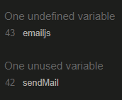
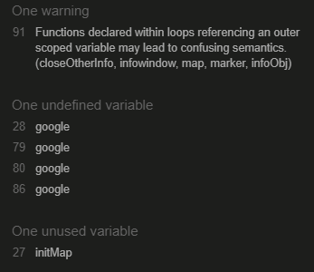

# Milestone Project 2 - Hiking with children on Södertörn - Testing details

[Link to README file](README.md/)

[View live website](https://mmmangooo.github.io/Milestone-Project2/)

## Testing

The page has been manually tested on the functionality of the following:

* Link from landing page to map page

* Links in navigation menu, including logo link to the left in navigation bar

* Map pins being clickable and info windows showing correctly

* Contact button launching contact modal on click

* Field requirements of contact form working correctly

* Mail sending in contact form working and email being sent

* Response message showing correctly on contact form being sent

### User stories testing

1. As a first time user, I want to quickly get an overview of what this site is for 

    * When the user enters the site, the first thing they see is the landing page. The landing page displays an image showing an adult and several children walking in nature, 
      and the heading on this page tells the user that they can find places to hike with your children with help from this site

2. As a user, I want to be able to easily navigate to different pages on the site and back again

    * The user finds a navigation bar on all pages except from the landing pages
    * When the user clicks one of the links in the navigation bar they is taken to the chosen page 
    * When the user clicks the logo in the top left hand side of the navigation bar, they is taken back to landing page
    * The user finds navigation links in the bottom of the page as well, and when the user clicks one of these they is taken to the chosen page

2. As a hiker with children, I want to easily find suitable hiking trails in the area of Södertörn

    * On the map page, the user finds a map showing the area of Södertörn with pins marking different locations from where the user can access hiking trails in this area
    * When the user clicks a pin on the map an info window appears and shows an overview of what services are accessible on that location, providing the user with information aiding 
      in a decision about what hiking trail might be suitable

3. As a hiker with children, I want to find out if the starting points/hiking trails provide access to:
 * Prepared fireplaces so I can make warm food for myself and the children
 * Toilets or portable toilets
 * Wind shelters if it starts to rain heavily or becomes very windy and the children needs shelter to stay warm
 * Hiking trails that you can walk with a child in stroller
 * Hiking trails with a length that is suitable for my childrens age and stamina
     * When the user clicks a pin on the map, an info window appears that contains icons that show if each of the above services are available from the location. The meaning of
       the icons are explained in a text box next to the map.

       

     * The user clicks a link in the info window, or in the navigation bar, and enters an info page about the chosen location. The info page contains information about the length of the trails available from each location

 

4. As a hiker with children, I want to be able to find more in-depth information about and some pictures of the different trails and starting points so I can show them to my children 
   and spark their interest in going there

     * The user finds in-depth information and images of each location in the info page
     * The user information provided is of a suitable length to be read to children without them losing their interest

      

     * The user finds two images on each info page and those images show some characteristics of the location that could be of interest to a child

      

5. As a user, I want to be able to contact the website administrator to alert them if something on the site is not working, or to suggest another
   starting point to be added to the site

     * The user finds a contact button above the footer on all pages except from landing page. 

      

     * When the user clicks the contact button, a modal appears that contains a contact form which the user can fill out to send an email directly to the site administrator
   
      
       

### Further testing

#### Validation

* HTML code has been validated using the [W3C Markup Validation](https://validator.w3.org/) with the following result:

* CSS code has been validated using the [W3C CSS Validator - Jigsaw](https://jigsaw.w3.org/css-validator/) with the following result:

* Javascript code has been validated using [JSHint](https://jshint.com/) with the following result:
    
    * Script.js

  
    
    * Map.js:

  

* Comments on JSHint results:
    * The warnings about undefined and unused variables are due to those variables being present in code retrieved through API:s
    * The warning "Functions declared within loops referencing an outer scoped variable may lead to confusing semantics. (closeOtherInfo, infowindow, map, marker, infoObj)" has been
      noted but I haven't found a way to solve it without breaking the functionality of the code. I have tried moving the entire function (starting on line 73 in map.js) inside the 
      loops above, I have tried wrapping all map functions in an outer loop and I have tried declaring all variables inside the function starting on line 73. All these solutions broke
      the functionality of the code. Since the keyword 'let' is used throghout the code (as opposed to 'var') there should not be any issues with out of scope variables. Because the code
      is functioning inspite of this warning being showed, and no functioning solution has been found, I have chosen to keep the code the way it is despite of the warning. The following
      sources have been used when searching for possible solutions:

      [Thread on stack Overflow: JavaScript closure inside loops – simple practical example](https://stackoverflow.com/questions/750486/javascript-closure-inside-loops-simple-practical-example)
      [Thread on Stack Overflow: Functions declared within loops referencing an outer scoped variable may lead to confusing semantics. What is wrong?](https://stackoverflow.com/questions/46027262/functions-declared-within-loops-referencing-an-outer-scoped-variable-may-lead-to)
      [Thread in Software Engineering: Is using a function inside a for loop bad practise?] https://softwareengineering.stackexchange.com/questions/314942/is-using-a-function-inside-a-for-loop-bad-practice

#### Usability and performance testing

* This website has been tested for usability and performance using the [Lighthouse tool](https://chrome.google.com/webstore/detail/lighthouse/blipmdconlkpinefehnmjammfjpmpbjk?hl=sv).
* The results from testing with this tool wa the following:
    * Landing page:

    

### Known bugs 

* Code for fading out landing page and showing map page failed to work. With help from tutor support I decided to change the way of creating landing page from 
  having a separate index.html and map.html respectively, to creating a landing page by using an overlay div. This allowed for the use of jquery fadeOut 
  effect to fade the overlay div out, showing the map page underneath. Having the landing 'page' as an overlay however proved to cause issues with navigation 
  to map page. The fade effect was therefore chosen to be removed entirely and the landing page was again put in a separate html file.

* The intended functionality of the user clicking a link inside the info window and by that triggering a function exchanging the content in the info window displayed
  did not work. When the link in the info window was clicked, nothing happened. This was because the id of the link was not possible to obtain and add to an event listener, 
  since it does not exist prior to the info window being loaded. After several attempts of solving this, and a lengthy contact with two different people on tutor support, 
  not being able to find a solution to work around this issue, I decided to opt out of this functionality altogether in favor of being able to focus on implementing other 
  functions and design and finish this project on time. 

### Solved bugs  

* Links in navigation bar in not collapsed mode (full screen) became unclickable at some point during development. I tried finding the error by comparing the navbar code with previously 
  commited code, while the navbar links worked. I also compared code to bootstrap documentation and didn't find the issue. The issue was found to be the nav logo container overflowing 
  the navbar links. This was solved by setting a fixed width to the nav logo container. 

* Cursor for links had an arrow insted of a pointer on hover on all pages except for index.html. Since index.html doesn't have any links to script files, I concluded
  that the code responsible for this error must be in the script files and not in css file. The error was solved by adding a general rule (using a:hover) in style.css with
  attribute cursor and value pointer.

* While testing the site on mobile device issues with how the site was displaying on Iphone6S and IphoneX where discovered: The landing page had vertical overflow, the images on 
  info pages where vertically stretched and the text box on the map page had the text overflowing and causing horizontal scrollbar on the page.
  Both these IPhone models had previously been tested for responsiveness in the dev tools in Chrome web browser without issues. The following was tried for fixing the issues:

   * Setting meta content value in html head to maximal-scale=1.0 instead of initial-scale=1.0
   
   * Removing meta content value width and only having initial-scale=1.0 as the value for content

   * Removing background-image on landing body in CSS, and removing background-size: cover on the same element

   * The problem was solved by resizing info-pages images again and setting maximum height on images on small screens. For landing page the issue was solved by shrinking all content
     on small screens, adding less vertical padding and setting overflow hidden. 

* When the HTML code was first run through the validator, it showed an error message on the page for Tyresta-By saying that the page seemed to be in swedish, but the language attribute
  on the page is set to english. This error was solved by setting language attribute to swedish in the p tag containing the info text.

* When the javascript code was first run in JSHint, a warning was thrown for each apperance of 'let' in the code, because 'let in new in ES6. This problem was solved by adding a line in the 
  script files telling that the version of the code is ES6: /*jshint esversion: 6 */. This solution was found on [Stack Overflow:](https://stackoverflow.com/questions/37247474/es6-in-jshint-jshintrc-has-esversion-but-still-getting-warning-using-atom/42865871)
  I later found out that there is an option in JSHint declaring that the code used is ES6, so the above solution was removed from the code and this solution was used instead.

### Out of scope

* Automated testing is not a requirement for the Milestone Project 2, and due to my lacking experience with automated testing in combination with limited time to finish this project,
  I have chosen not to run any automated tests for this project. 
