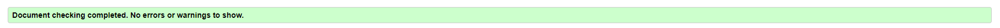

# Milestone Project 2 - Hiking with children on Södertörn - Testing details

[Link to README file](README.md/)

[View live website](https://mmmangooo.github.io/Milestone-Project2/)

## Testing

The page has been manually tested on the functionality of the following:

* Link from landing page to map page

* Links in navigation menu, including logo link to the left in navigation bar

* Map pins being clickable and info windows showing correctly

* Contact button launching contact modal on click

* Field requirements of contact form working correctly

* Mail sending in contact form working and email being setting

* Response message showing correctly on contact form being sent

### User stories testing

1. As a first time user, I want to quickly get an overview of what this site is for 

    * The landing page displays an image showing an adult and several children walking in nature, and the heading on this page tells that ypu can find places to hike with your children
      with the help from this site

2. As a user, I want to be able to easily navigate to different pages on the site and back again

    * A navigation bar is present on all pages except from the landing page and it contains links to all pages 
    * A logo is present in navigation bar, in the top left hand side of the screen, on all pages except for landing page, and this logo when clicked takes the user back to landing pag
    * The footer contains link to all pages except from landing page, which ensures that the user can navigate to different pages from the bottom of pages as well

2. As a hiker with children, I want to easily find suitable hiking trails in the area of Södertörn

    * The map page provides a map showing the area of Södertörn with pins marking different locations from where the user can access hiking trails in this area
    * When the user clicks a pin on the map an info window appears and shows an overview of what services are accessible on that location, providing the user with information aiding 
      in a decision about what hiking trail might be suitable

3. As a hiker with children, I want to find out if the starting points/hiking trails provide access to:
 * Prepared fireplaces so I can make warm food for myself and the children
 * Toilets or portable toilets
 * Wind shelters if it starts to rain heavily or becomes very windy and the children needs shelter to stay warm
 * Hiking rails that you can walk with a child in stroller
 * Hiking trails with a length that is suitable for my childrens age and stamina
     * The info windows that appear when the user clicks on a pin on the map contains icons that show if each of the above services are available from the location. The meaning of
       the icons are explained in a text box next to the map.
     * The info pages about the locations contains information about the length of the trails available from each location

 

4. As a hiker with children, I want to be able to find more in-depth information about and some pictures of the different trails and starting points so I can show them to my children 
   and spark their interest in going there

     * The info pages about each location contains in-depth information and images of that location
     * The information provided is of a suitable length to be read to children without them losing their interest
     * There are only two images on each page and they are chosen to show some the characteristics of the location that could be of interest to a child

 
 

5. As a user, I want to be able to contact the website administrator to alert them if something on the site is not working, or to suggest another
   starting point to be added to the site

     * All pages except for the landing page contains a contact button above the footer. By clicking the contact button the user gets access to a contact form which sends emails
       directly to the site administrator
 
 
       

### Further testing

* HTML code has been validated using the [W3C Markup Validation](https://validator.w3.org/) with the following result:

* HTML code has been validated using the [W3C HTML Validator](https://validator.w3.org/)

* CSS code has been validated using the [W3C CSS Validator - Jigsaw](https://jigsaw.w3.org/css-validator/) with the following result:

* Javascript code has been validated using [JSHint](https://jshint.com/) with the following result:

### Known bugs

#### During development

* Code for fading landing page to show map page failed to work. With help from tutor support I decided to change the way of creating landing page from 
  having a separate index.html and map.html respectively, to creating a landing page by using an overlay div. This allowed for the use of jquery fadeOut 
  effect to fade the overlay div out, showing the map page underneath. Having the landing 'page' as an overlay however proved to cause issues with navigation 
  to map page. The fade effect was therefore chosen to be removed entirely and the landing page was again put in a separate html file.

* The functionality of the user clicking a link inside the info window and by that triggering a function exchanging the content in the info window displayed
  did not work because the id of the link was not possible to obtain and add to an event listener, since it does not exist prior to the info window 
  being loaded. After several attempts of solving this, and a lengthy contact with to different people on tutor support, not being able to find a solution
  to work around this issue, I decided to opt out of this functionality altogether in favor of being able to focus on implementing other functions and
  design and finish this project on time. 

* Links in navigation bar in not collapsed mode (full screen) became uncklickable at some point during development. Tried finding the error by comparing the navbar code with previously commited
  code, while the navbar links worked. Also compared code to bootstrap documentation and didn't find the issue. After some help from tutor support, the issue was found to be the nav logo 
  container overflowing the navbar links. This was solved by setting a fixed width to the nav logo container. 

* Cursor for links had an arrow insted of a pointer on hover on all pages except for index.html. Since index.html doesn't have any links to script files, I concluded
  that the code responsible for this error must be in the script files and not in css file. The error was solved by adding a general rule (using a:hover) in style.css with
  attribute cursor and value pointer.

#### During testing

* While testing the site on mobile device issues with how the site was displaying on Iphone6S and IphoneX where discovered: Both these models had previously been tested for responsiveness
  in the dev tools in Chrome web browser without issues. The following was tried for fixing the issue:

   * Setting meta content value in html head to maximal-scale=1.0 instead of initial-scale=1.0
   
   * Removing meta content value width and only having initial-scale=1.0 as the value for content

   * Removing background-image on landing body in CSS, and removing background-size: cover on the same element

   * The problem was solved by resizing info-pages images again and setting maximum height on images on small screens. For landing page the issue was solved by shrinking all content
     on small screens, adding less vertical padding and setting overflow hidden. 

* When the HTML code was first run through the validator, it showed an error message on the page for Tyresta-By saying that the page seemed to be in swedish, but the language attribute
  on the page is set to english. This error was solved by setting language attribute to swedish in the p tag containing the info text.

### Out of scope

* Automated testing is not a requirement for the Milestone Project 2
